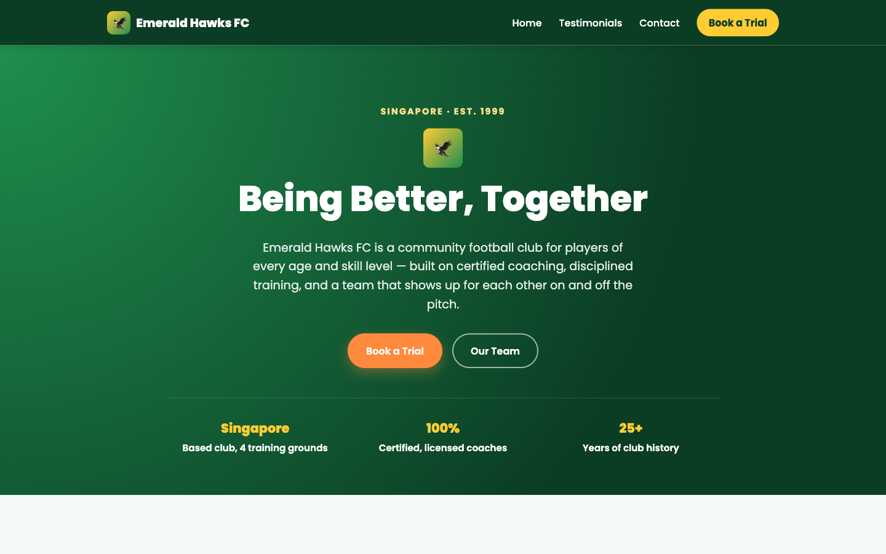

# Austcham Paddle Club Singapore

A single-page marketing site for Austcham Paddle Club, one of Singapore's longest-established dragon boat and outrigger canoe clubs, built with plain HTML, CSS, and JavaScript — no frameworks, no build step, no dependencies.

**Live site:** https://mybluecoffeecup-ops.github.io/austcham-paddle-club/



> Note: the screenshot above still shows the previous football-themed design and needs to be retaken against the current page.

## Features

- Sticky, responsive navbar with the club crest logo, an underline treatment marking each link, a mobile hamburger menu, and links to Why Austcham, Races, the 10km Challenge, Membership, Training Times, FAQs, and Sign Up
- Full-bleed hero with an animated waterline — drifting SVG wave layers and a bobbing fleet of dragon boat / outrigger silhouettes (respects `prefers-reduced-motion`)
- "Our Mighty Crew" showcase with the club team photo, a cursor-following spotlight, scroll parallax, and club stats that count up on scroll
- "Pick Your Paddle Style" swipeable stacked-deck carousel — Dragon Boat, Outrigger Canoe, Single Crafts, and Land & Socials as real photo cards, navigable by drag/swipe, arrow buttons, or dots, with a cursor-following spotlight on desktop
- "Paddle, Party and Progress" section highlighting the club's history (est. 1988), its 2024 IDBF Club Crew World Championships grand final result, and the social side of the club
- "Our Latest Races" scroll-driven 3D fly-through — race cards travel toward the viewer as you scroll a pinned stage, with a static grid fallback for `prefers-reduced-motion`
- SDBA–AustCham 10km Challenge event banner
- Testimonials grid with real Google reviews — each card is a native `<details>` that clamps to three lines and expands via a "Read full review" toggle, with scroll-triggered fade-in animations
- Membership ("Pick Your Lane") section styled as a race course — four lanes (annual/quarterly, full/affiliate) separated by animated beaded buoy-rope dividers, a benefits bullet list, and a student strip. Prices are currently hidden via a `display: none` rule on `.lane-price` / `.student-price`; delete those two commented lines in the `<style>` block to show them again.
- "How Do I Get Started?" banner (modeled on the 10km Challenge banner) with the three-step sign-up flow and a trial CTA
- Weekly training-times grid covering outrigger (Sentosa), dragon boat (Kallang), and land sessions
- Newbie FAQ accordion (native `<details>`/`<summary>`) with a what-to-bring checklist
- Enquiry form — name, email, phone and message — with client-side validation on name/email/phone, accessible inline error messages, live submission via [FormSubmit](https://formsubmit.co/), and a confetti + voice-message celebration on success
- Floating WhatsApp chat widget (bottom-right) with suggested quick-reply questions and deep links to `wa.me`
- SEO metadata: descriptive title/description, Open Graph & Twitter cards, canonical URL, and JSON-LD structured data
- Footer with contact details, quick links, social links, and an auto-updating copyright year

## Sentosa paddle conditions page

[`conditions/`](conditions/) is a separate quick-reference page for crews launching from Siloso Beach, Sentosa — live at https://mybluecoffeecup-ops.github.io/austcham-paddle-club/conditions/. It has a **Right now** view and forecasts for the next club sessions (Tue 6am and Thu 6am — 10 km; Sat 8am and Sun 4pm — islands):

- **Go / Hold verdict on the club rules** — no paddling during a CAT 1 lightning alert (modelled on myENV: cloud-to-ground lightning, or a thundery / heavy-rain 2-hr forecast, within 6 km of Siloso) or when the southern 24-hr PSI is above 120.
- **Lightning & rain** — strikes in the last 30 min with distance from Siloso, the earliest all-clear time, NEA 2-hr forecasts for nearby areas, the nearest rain gauge, and an animated NEA rain radar with the 6 km CAT 1 ring and strikes plotted.
- **Haze** — 24-hr PSI and 1-hr PM2.5 for the southern region.
- **Tide, current & route plan** — rising/falling, height, next turn, a 3-day tide curve with night shading and session markers, and per-route advice following the club rule of pushing into the current first and riding it home (falling tide → push East): the weekday 10 km out-and-back East to the White Marker says whether each leg has the current with or against it, and the weekend islands loop (up to 2.5 hrs) says which way round to go. Advice uses the net current over each half of the paddle, so a tide turning mid-paddle is accounted for. Tide turns come from [tide-forecast.com (Victoria Dock)](https://www.tide-forecast.com/tide/Singapore-Victoria-Dock/tide-times), scraped by `conditions/scripts/fetch_tides.py` during each Pages deploy; when that data is missing, stale or doesn't reach far enough ahead, the page uses Open-Meteo's modelled sea level.
- **Wind** (info only — no club wind limit) — Open-Meteo forecast for Siloso, nearest NEA station observation, and an on-demand Windy map.
- **Session cards** — tide and current at the start, route plans, a mini tide chart showing both paddle windows, forecast wind and rain chance, and the NEA 4-day outlook.

Rules, routes (with estimated durations), session times and the current direction convention live in the `CONFIG` object at the top of the page's `<script>`.

Live NEA data comes from the public [data.gov.sg](https://data.gov.sg/) real-time APIs, fetched in the browser and refreshed every 5 minutes.

## Getting started

There's nothing to install or build. Clone the repo and open the file directly in a browser:

```bash
git clone https://github.com/mybluecoffeecup-ops/austcham-paddle-club.git
cd austcham-paddle-club
open index.html
```

## Project structure

```
index.html                        # entire site: HTML structure, inline <style>, inline <script>
Pictures/                         # image assets referenced by the page (club team photo, boat silhouettes)
assets/                           # README screenshot and supporting media
.github/workflows/deploy-pages.yml # GitHub Pages deploy workflow
CLAUDE.md                         # architecture notes and manual verification checklist
```

Everything lives in one file, organized into three layers: HTML markup, a single `<style>` block, and a single `<script>` block at the end of `<body>`. See [CLAUDE.md](CLAUDE.md) for a full architecture breakdown.

## Deployment

Pushes to `main` (and a 3-hourly schedule, which keeps the conditions page's tide data fresh) automatically deploy to GitHub Pages via the workflow at [.github/workflows/deploy-pages.yml](.github/workflows/deploy-pages.yml). The workflow uploads the whole repo as a Pages artifact (`actions/upload-pages-artifact`) and publishes it with `actions/deploy-pages` — there is no build step. It can also be run manually from the Actions tab via `workflow_dispatch`.

## Verifying changes

There is no linter or test suite. After editing `index.html`, open it in a browser and walk the manual checklist in [CLAUDE.md](CLAUDE.md) — nav scrolling and the hamburger menu, mobile (~375px) and desktop layouts, the sports carousel, the `#races` fly-through (including with reduced motion enabled), the testimonial expand/collapse, the WhatsApp widget, and a keyboard-only tab pass. Note the enquiry form posts to a live FormSubmit endpoint that emails the club inbox.
